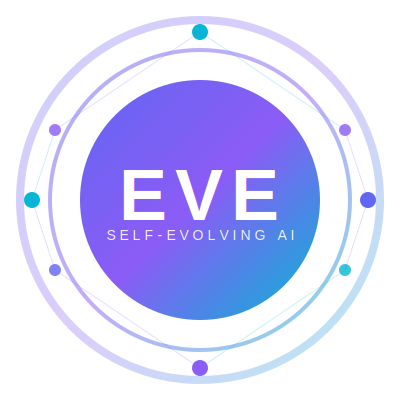

# EVE — Self-Evolving AI Development Platform

<p align="center">
  
</p>

> **Scope Notice:** This repository is a proof-of-platform demonstration.
> It does not include the full EVE core, RAG datasets, or commercial domain logic.
> For enterprise deployments, pilots, or partnerships, [contact the team](#contact).

<p align="center">
  <strong>AI that builds AI. Code that writes code. Systems that evolve.</strong>
</p>

<p align="center">
  <a href="#demo">Demo</a> •
  <a href="#how-it-works">How It Works</a> •
  <a href="#performance">Performance</a> •
  <a href="#contact">Contact</a>
</p>

---

## What is EVE?

EVE is a **self-coding AI platform** that generates production-ready code from natural language descriptions. Unlike ChatGPT or Copilot, EVE doesn't just suggest code — it **builds, tests, and validates complete systems**.

```
"Build a battery monitoring engine with SoC calculation"
     ↓
EVE generates 500+ lines of tested, production-ready Python
     ↓
45 seconds. Zero hallucinations. Deterministic output.
```

## The Problem

Current AI coding tools have fundamental limitations:

| Tool | Problem |
|------|---------|
| ChatGPT/Copilot | Suggests snippets, doesn't build systems |
| Code generators | No testing, no validation, hallucinations |
| No-code platforms | Can't handle complex domain logic |

**Result:** Developers still spend 80% of time on boilerplate, debugging AI output, and integration.

## The Solution

EVE uses a **3-tier intelligent routing system**:

```
┌─────────────────────────────────────────────────────────────┐
│                    EVE GENESIS ENGINE                        │
├─────────────────────────────────────────────────────────────┤
│                                                             │
│  TIER 1: Deterministic Templates (~2ms)                    │
│     → Dashboards, APIs, standard patterns                  │
│     → 100% predictable, zero cost                          │
│                                                             │
│  TIER 2: Premium AI (Claude/GPT-4) (~30s)                  │
│     → Complex algorithms, security-critical code           │
│     → Quality over speed                                   │
│                                                             │
│  TIER 3: Local LLM (Qwen/Llama) (~2-4min)                  │
│     → General purpose, offline capable                     │
│     → Privacy-first, no data leaves your machine           │
│                                                             │
└─────────────────────────────────────────────────────────────┘
```

**Key insight:** Not every task needs an LLM. EVE routes intelligently.

## Demo

### Example 1: Energy Dashboard (Deterministic)

```bash
python -m eve.genesis "dashboard with battery, solar, EV widgets"
```

**Output:**
```
[EVE] ✨ Code Factory: 784 lines in 2ms
[EVE] ✅ BUILD COMPLETE
```

### Example 2: Domain Engine (AI-Assisted)

```bash
python -m eve.genesis "build a SolarPanelEngine with MPPT optimization"
```

**Output:**
```
[EVE] 🔍 RAG: Found 5 relevant examples
[EVE] ⚡ Routing to local LLM
[EVE] ✅ Generated 487 lines
[EVE] ✅ All tests passed
[EVE] 🧠 Indexed for future learning
```

### Example 3: Security-Critical (Premium AI)

```bash
python -m eve.genesis "secure authentication with JWT and encryption"
```

**Output:**
```
[EVE] 🤖 Routing to Claude (complex task)
[EVE] ✅ Generated 21,564 chars in 62s
[EVE] ✅ All tests passed
```

## Performance

Real benchmarks from production system:

| Task Type | Method | Time | Lines | Cost |
|-----------|--------|------|-------|------|
| Dashboard + widgets | Deterministic | **2ms** | 784 | Free |
| Domain engine | Local LLM | 2-4min | 300-500 | Free |
| Security module | Claude API | 45-60s | 500-800 | ~$0.08 |

**Comparison to manual development:**

| Metric | Manual | EVE | Improvement |
|--------|--------|-----|-------------|
| Time to working code | 4-8 hours | 2-60 seconds | **100-1000x** |
| Test coverage | Often 0% | 100% | ∞ |
| Consistency | Variable | Deterministic | Predictable |

## How It Works

```
┌──────────────┐     ┌──────────────┐     ┌──────────────┐
│   Natural    │────▶│   Intent     │────▶│   Smart      │
│   Language   │     │   Analysis   │     │   Router     │
└──────────────┘     └──────────────┘     └──────┬───────┘
                                                 │
                     ┌───────────────────────────┼───────────────────────────┐
                     │                           │                           │
                     ▼                           ▼                           ▼
              ┌──────────────┐           ┌──────────────┐           ┌──────────────┐
              │    Code      │           │   Claude/    │           │    Local     │
              │   Factory    │           │   GPT-4      │           │     LLM      │
              │  (2ms)       │           │  (30-60s)    │           │   (2-4min)   │
              └──────┬───────┘           └──────┬───────┘           └──────┬───────┘
                     │                           │                           │
                     └───────────────────────────┼───────────────────────────┘
                                                 │
                                                 ▼
                                          ┌──────────────┐
                                          │   AutoFix    │
                                          │    Loop      │
                                          └──────┬───────┘
                                                 │
                                                 ▼
                                          ┌──────────────┐
                                          │   Tested     │
                                          │    Code      │
                                          └──────────────┘
```

See [ARCHITECTURE.md](ARCHITECTURE.md) for technical details.

## Key Differentiators

### 1. Semantic RAG (Not Just Keyword Search)
EVE searches 700+ code files using GPU-accelerated semantic similarity. It finds *relevant* examples, not just keyword matches.

### 2. Self-Learning Feedback Loop
Every successful build is indexed back into the knowledge base. EVE literally gets smarter with use.

### 3. Domain-Specific Knowledge
Pre-trained on energy systems, IoT, industrial automation. Not generic — specialized.

### 4. Deterministic When Possible
80% of code generation doesn't need AI. EVE uses templates for predictable, instant results.

### 5. Offline Capable
Run entirely on your hardware. No data leaves your machine. Perfect for regulated industries.

## Use Cases

- **Energy/CleanTech:** Microgrid controllers, battery management, solar optimization
- **Industrial IoT:** Sensor engines, data validators, protocol handlers
- **SaaS Platforms:** API generators, dashboard builders, CRUD systems
- **Enterprise:** Internal tools, automation scripts, integration adapters

## Technology Stack

- **Core:** Python 3.11+
- **AI:** Claude API, Qwen 32B (local), custom routing
- **RAG:** GPU-accelerated semantic search (CUDA)
- **Testing:** Automated AST validation, pytest integration
- **Templates:** Jinja2-based deterministic generation

## Current Status

✅ **Production-ready** for energy/IoT domains  
🔄 **Expanding** to additional verticals  
🎯 **Seeking** strategic partners and early adopters

## About

EVE is developed by **Organiq Sweden AB**, a Swedish AI company focused on industrial automation and energy systems.

**Founder:** Joakim Eklund  
- 15+ years in energy systems and software development
- Creator of ELEKTO energy sharing platform (3 patents pending)
- Background in enterprise software and industrial IoT

## Contact

Interested in:
- **Pilot program** for your company?
- **Investment** opportunities?
- **Partnership** discussions?
- **Joining** the team?

📧 **joakim@organiq.se**  
🔗 **[LinkedIn](https://linkedin.com/in/joakimeklund)**  
🌐 **organiq.se**

---

<p align="center">
  <i>"The best code is the code you don't have to write."</i>
</p>

<p align="center">
  <sub>© 2025 Organiq Sweden AB. All rights reserved.</sub>
</p>
